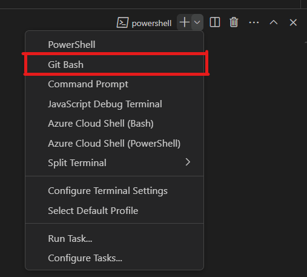

# Przykład użycia wzorca MVC w aplikacji internetowej przy użyciu Frameworka Flask
Kod z warsztatów jakie prowadziłem na lekcji jako dodatek do prezentacji o MVC.

# Jak skonfigurować projekt by działał?
### Pycharm Professional
- Tworzymy nowy projekt i wybieramy template Flask
- wpisujemy nazwę i klikamy 'Create'
- wszystko inne robi za nas edytor

### Pycharm Community Edition
- Tworzymy nowy projekt
- Wchodzimy w menu: File -> Settings -> Project -> Project interpreter
- Klikamy znak `+`
- Otwiera się okienko z dostępnymi paczkami, w inputa na górze wpisujemy flask i pobieramy
- jak pobieranie się skończy, wszytsko jest gotowe

### VS Code
- Tworzymy nowy folder i go otwieramy w Visual Studio Code
- Otwieramy termianal (skrót: <kbd>Ctrl</kbd> + <kbd>Shift</kbd> + <kbd>`</kbd>)
- Wpisujemy `python -m venv venv` aby utworzyć wirtualne środowisko
- otwieramy terminal bash, w tym celu trzeba kliknąć strzałeczkę koło plusa i wybrać `git bash`
    -   
- jak już jesteśmy w terminaly bash wpisujemy: `. venv\Scripts\activate`, aby aktywować środowisko wirtualne
- następnie `pip install flask` by zainstalować flaska w środowisku wirtualnym projektu
- od tego momentu można stworzyć strukturę projektu manualnie, a jak chcecie się pobawić komendami to macie:
  	- `touch app.py`, `touch model.py`, `mkdir templates`, `cd templates`, `touch index.html`, `cd ..`
- aby uruchomić aplikację (po ściągnięciu lub przekopiowaniu kodu) można uruchomić ją w terminalu `python app.py` 	
